# UNe3dMe: A Unified Interface for Neural 3D Reconstruction Methods

<table>
	<thead>
    	<tr>
      		<th style="text-align:center">日本語</th>
      		<th style="text-align:center"><a href="README_en.md">English</a></th>
    	</tr>
  	</thead>
</table>

# 1. 概要  
このシステムは様々な3次元再構築手法を Web UI で一元的に扱えるようにしたものです．  
1つの UI 上で前処理，各手法による3次元再構築，可視化および評価を簡単に実行できます．

## 実装手法一覧
- [Nerfstudio](https://github.com/nerfstudio-project/nerfstudio/)
- [Vanilla NeRF（Nerfstudio）](https://github.com/bmild/nerf)
- [Nerfacto（Nerfstudio）](https://github.com/nerfstudio-project/nerfstudio/)
- [mip-NeRF（Nerfstudio）](https://github.com/google/mipnerf)
- [SeaThru-NeRF（Nerfstudio）](https://github.com/deborahLevy130/seathru_NeRF)
- [Vanilla GS](https://github.com/graphdeco-inria/gaussian-splatting)
- [Mip-Splatting](https://github.com/autonomousvision/mip-splatting)
- [Splatfacto（Nerfstudio）](https://github.com/nerfstudio-project/nerfstudio/)
- [4D-Gaussians](https://github.com/hustvl/4DGaussians)
- [DUSt3R](https://github.com/naver/dust3r)
- [MASt3R](https://github.com/naver/mast3r)
- [MonST3R](https://github.com/Junyi42/monst3r)
- [Easi3R](https://github.com/Inception3D/Easi3R)
- [MUSt3R](https://github.com/naver/must3r)
- [Fast3R](https://github.com/facebookresearch/fast3r)
- [Splatt3R](https://github.com/btsmart/splatt3r)
- [CUT3R](https://github.com/CUT3R/CUT3R)
- [WinT3R](https://github.com/LiZizun/WinT3R)
- [VGGT](https://github.com/facebookresearch/vggt)
- [VGGSfM](https://github.com/facebookresearch/vggsfm)
- [VGGT-SLAM](https://github.com/MIT-SPARK/VGGT-SLAM)
- [StreamVGGT](https://github.com/wzzheng/StreamVGGT)
- [FastVGGT](https://github.com/mystorm16/FastVGGT)
- [Pi3](https://github.com/yyfz/Pi3)
- [MoGe2](https://github.com/microsoft/MoGe)
- [UniK3D](https://github.com/lpiccinelli-eth/UniK3D)
- [Depth-Anything-V2](https://github.com/DepthAnything/Depth-Anything-V2)
- [Depth-Anything-3](https://github.com/ByteDance-Seed/depth-anything-3)

# 2. インストール
このシステムは Ubuntu を対象としています．Windows では一部利用できない手法があります．

`torch`，`torchvision`は起動環境の CUDA に合わせたものをインストールしてください．下記の例の実行環境には CUDA 12.1が入っています．
```
git clone --recursive https://github.com/WSuenaga/UNe3dMe.git
cd UNe3dMe

conda create -n UNe3dMe python=3.11 -y
conda activate UNe3dMe

pip install torch==2.1.0+cu121 torchvision==0.16.0+cu121 --index-url https://download.pytorch.org/whl/cu121

pip install -r requirements.txt
```

前処理手法として **FFmpeg**，**COLMAP** を用いています．
- FFmpegのインストール
    ```
    sudo apt update
    sudo apt install ffmpeg
    ```
- COLMAPのインストール  
    https://colmap.github.io/install.html  


各手法については個別にインストールしてください．

# 3. クイックスタート
Mip-Splattingのインストールから，データセットの作成，学習，3次元再構築結果の可視化，レンダリング・評価までの一連の手順を説明します．  

## 3.1. Mip-Splatting のインストール
Mip-Splattingの環境構築を行います．このリポジトリにある **models/mip-splatting/** に移動し，以下のコマンドを実行してください．
```
# mip-splatting のリポジトリへ移動
cd models/mip-splatting

# conda 環境の作成
conda create -y -n mip-splatting python=3.10
conda activate mip-splatting

# 依存関係のインストール
# 実行環境に入っているCUDAに合わせた torch, torchvision をインストールしてください．（この例では CUDA12.1）
pip install torch==2.1.0+cu121 torchvision==0.16.0+cu121 --index-url https://download.pytorch.org/whl/cu121
conda install -c "nvidia/label/cuda-12.1.0" cuda-toolkit

pip install "numpy<2.0" open3d plyfile ninja GPUtil opencv-python lpips

pip install submodules/diff-gaussian-rasterization
pip install submodules/simple-knn

cd ../..
```
## 3.2. Web UI の起動
conda 環境を activate し，**main.py** を実行することで Web UI を起動できます．
表示された local URL にブラウザからアクセスしてください．
```
conda activate UNe3dMe
python main.py
```
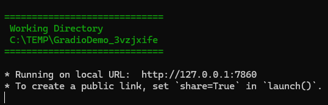  

## 3.3. 画像データセットの作成
データセットの作成を行います．タブ一覧より`🗂️ データセット`を選択し，`🛠️ 新規データセットの作成`を選択してください．  
ファイルの種類は`🎥 動画`を選択してください．

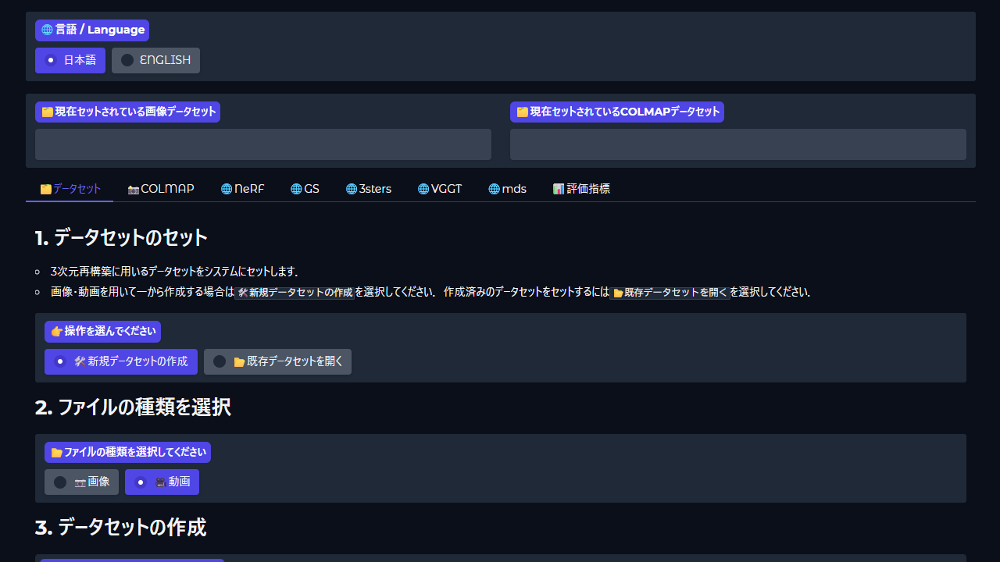

画像データセットを作成するための動画を入力します．  
**example/** 内にある **example01.mp4** を選択してください．

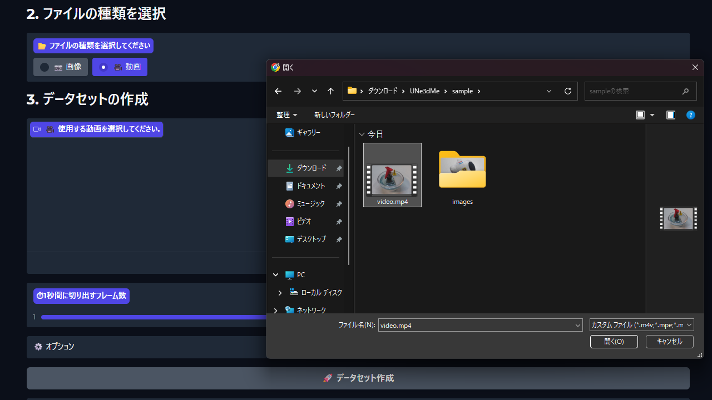

`🚀 データセット作成`を押すことで**画像データセット**が作られます．  
`🗂️ 現在セットされている画像データセット`にパスが表示されれば成功です．

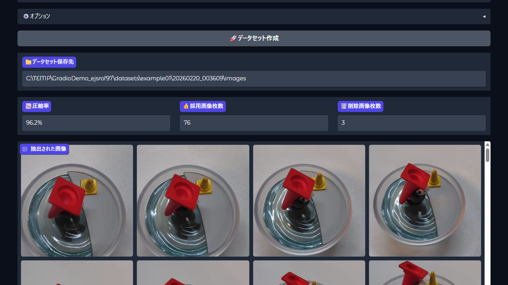

## 3.4. COLMAP データセットの作成
Mip-Splatting は COLMAP 形式のデータセットを要求します．COLMAP形式のデータセット（**COLMAPデータセット**）は直前に作成した画像データセットから作成できます．
`📸 COLMAP` タブに移動し，`🚀 COLMAP実行`ボタンを押してください．  
下記の実行ログのように **🎉 🎉 🎉 All DONE 🎉 🎉 🎉** と表示され，`🗂️ 現在セットされているCOLMAPデータセット`にパスが表示されれば成功です．

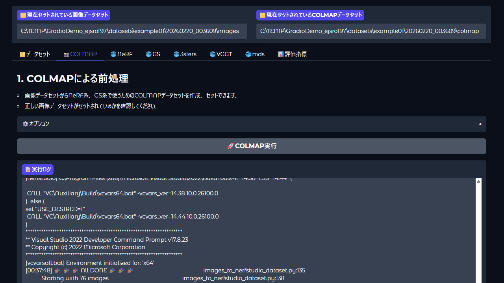

## 3.5. Mip-Splattingの学習
Mip-Splatting は GS ベースの手法です．`🌐 GS` タブに移動してください．  
`🌐 GS` タブ内から `Mip-Splatting` を選択してください．  

学習の中断は行えません．学習前に`🗂️ 現在セットされているCOLMAPデータセット`が正しいものか確認してください．  

`🚀 学習実行`ボタンを押すことで Mip-Splatting の学習が開始されます．

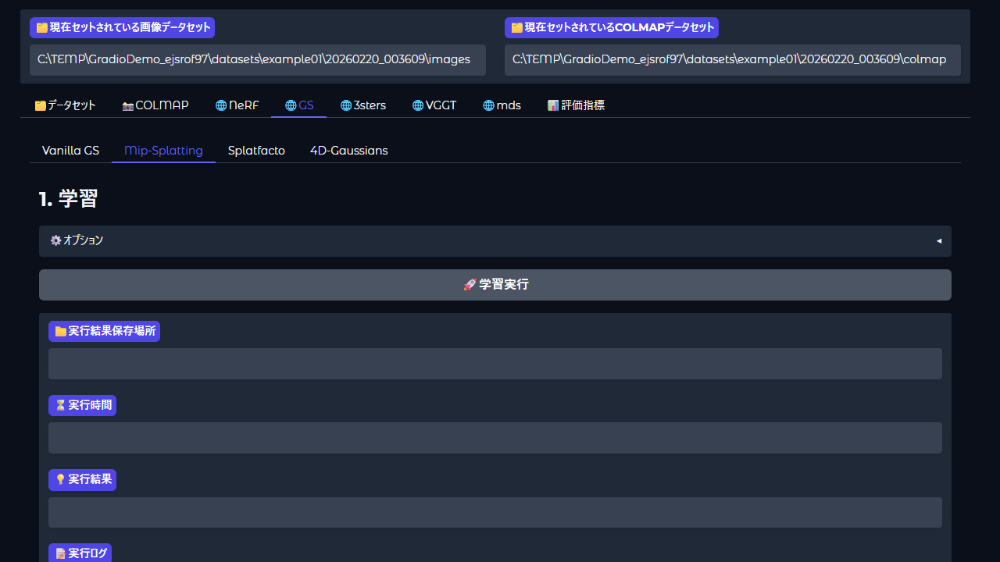

学習が完了あるいは失敗すると実行結果が表示されます． 
失敗した場合は`📝 実行ログ`を確認してください． 

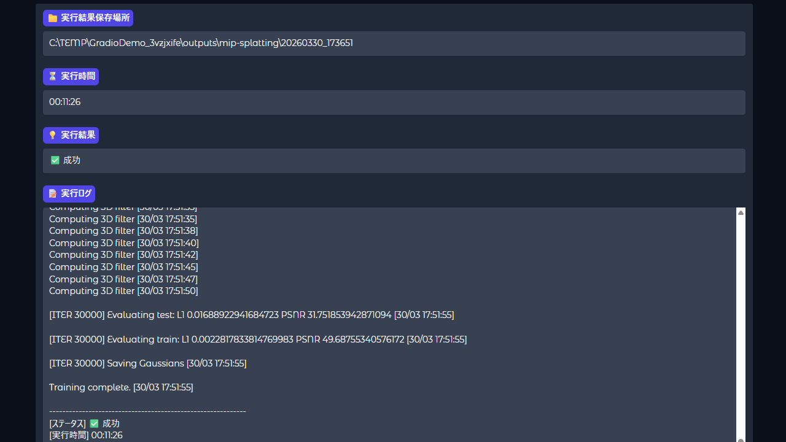

## 3.6. 3次元再構築結果の可視化
このシステムでは **viser** を使って3次元再構築結果を可視化しています．`🚀 ビューアの起動`ボタンを押すことでサーバを起動できます．  
`ビューアのURL`にURLが表示されれば起動成功です．ブラウザからアクセスしてください．
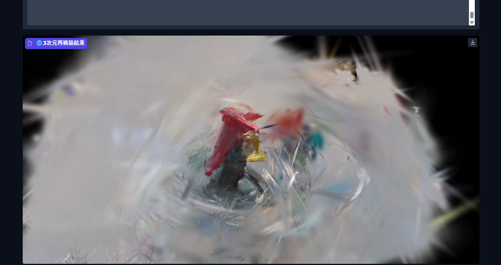

ビューア内での操作方法は右のサイドパネルにしたがって下さい．
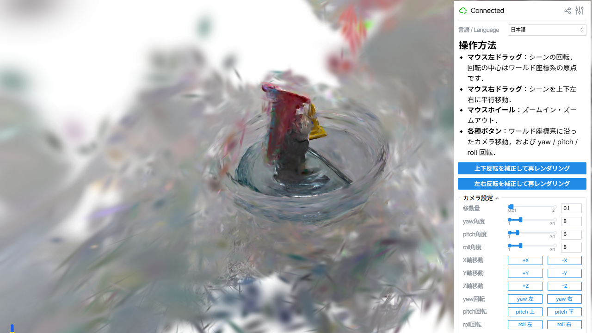

ビューアを閉じる際には，サイドパネルの一番下のサーバ設定内のチェックボックスにチェックを入れ，`サーバ停止`ボタンを押してください．
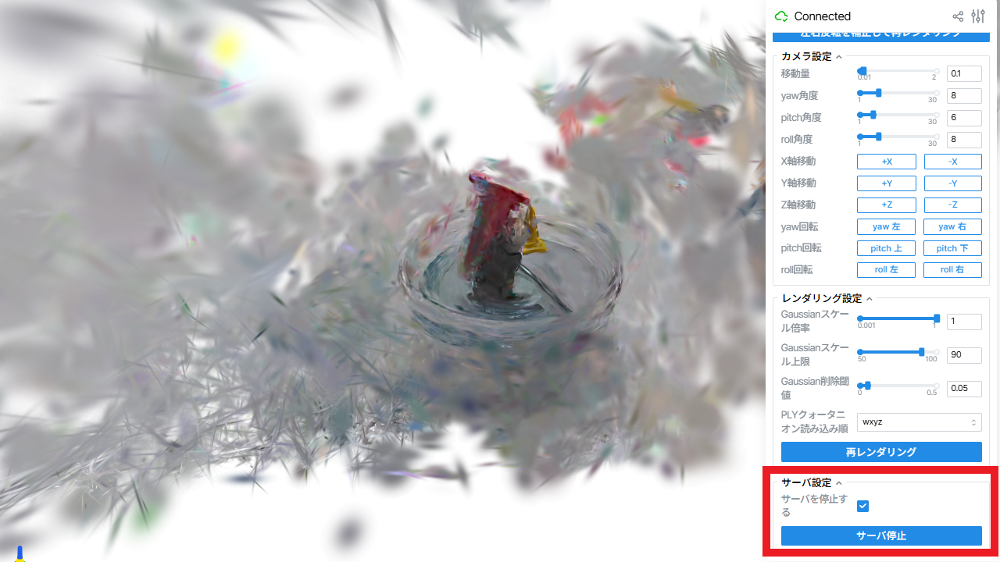

## 3.7. レンダリング・評価
`🚀 レンダリング＆評価実行`ボタンを押すことで3次元再構築結果からテスト画像のレンダリングと，テスト画像の定量的評価を行うことができます．  
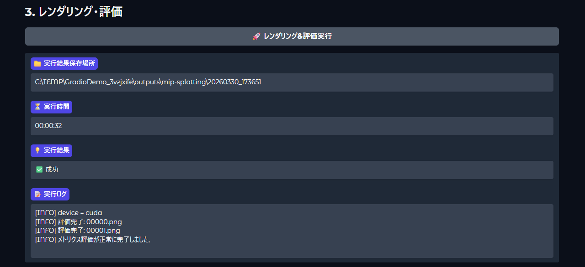
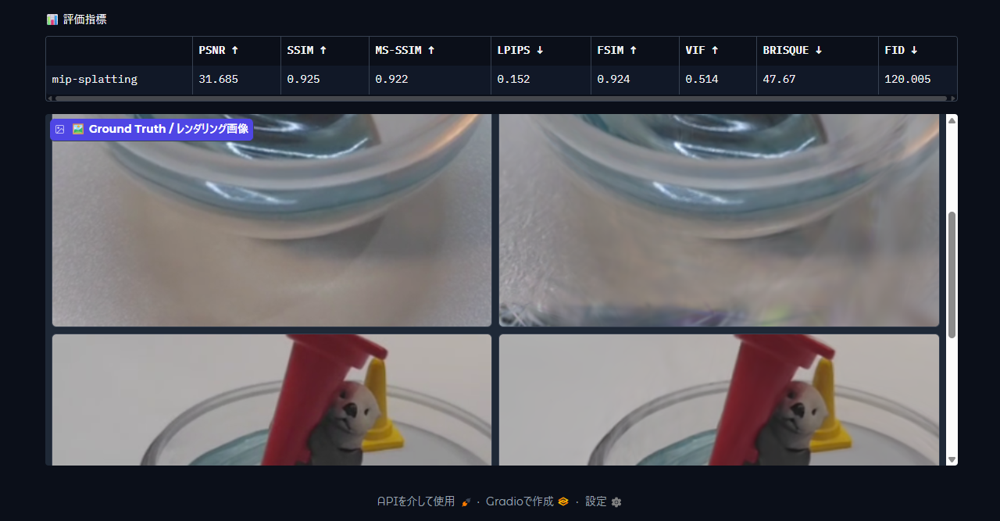

