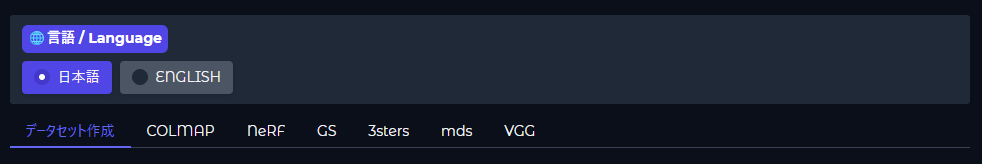
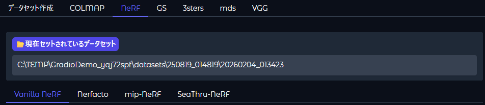

# 統合3次元再構築システム（仮）
# 1. 概要  
このシステムは様々な3次元再構築手法を Web UI で一元的に扱えるようにしたものです.  
1つの UI 上で前処理，各手法による3次元再構築，可視化および評価を簡単に実行できます．
## 実装手法一覧
- Vanilla NeRF（Nerfstudio）
- Nerfacto（Nerfstudio）
- mip-NeRF（Nerfstudio）
- SeaThru-NeRF（Nerfstudio）
- Vanilla GS
- Mip-Splatting
- Splatfacto（Nerfstudio）
- 4D-Gaussians
- DUSt3R
- MASt3R
- MonST3R
- Easi3R
- MUSt3R
- Fast3R
- Splatt3R
- CUT3R
- WinT3R
- MoGe
- UniK3D
- VGGT
- VGGSfM
- VGGT-SLAM
- StreamVGGT
- FastVGGT
- Pi3
# 2. インストール
このシステムは Ubuntu を対象としています．

Web UI は **gradio** により実装されています．
```
conda create -n demo python=3.11 -y
conda activate demo

pip install gradio==5.35.0
pip install requests opencv-python scikit-image
```

前処理手法として **FFmpeg**，**COLMAP** を用いています．
- FFmpegのインストール
    ```
    sudo apt update
    sudo apt install ffmpeg
    ```
- COLMAPのインストール  
https://colmap.github.io/install.html

各手法のインストールは基本的に，それぞれの公式リポジトリに従って conda 環境を作成してください．

## 2.1. 学習済みモデルのダウンロード
以下の手法は学習済みモデルを要求します．各リポジトリ内で以下を行ってください．
- MUSt3R https://github.com/naver/must3r?tab=readme-ov-file#checkpoints
    - 上記より以下をダウンロード.
        - MUSt3R_512.pth
        - MUSt3R_512_retrieval_codebook.pkl
        - MUSt3R_512_retrieval_trainingfree.pth
    - ckpt ディレクトリを作成し，その中にダウンロードしたものを配置．
        ```
        mkdir ckpt
        ```
- Fast3R
    - MUSt3R同様．
- CUT3R
    ```
    cd src
    # for 224 linear ckpt
    gdown --fuzzy https://drive.google.com/file/d/11dAgFkWHpaOHsR6iuitlB_v4NFFBrWjy/view?usp=drive_link 
    # for 512 dpt ckpt
    gdown --fuzzy https://drive.google.com/file/d/1Asz-ZB3FfpzZYwunhQvNPZEUA8XUNAYD/view?usp=drive_link
    cd ..
    ```
- WinT3R
    - 以下をダウンロード．  
    [https://huggingface.co/lizizun/WinT3R/resolve/main/pytorch_model.bin](https://huggingface.co/lizizun/WinT3R/resolve/main/pytorch_model.bin)
    - checkpoints ディレクトリを作成し，その中にダウンロードしたものを配置．
        ```
        mkdir checkpoints
        ```
- StreamVGGT
    - 以下をダウンロード．  
    https://huggingface.co/facebook/VGGT-1B/blob/main/model.pt
    - ckpt ディレクトリを作成し，その中にダウンロードしたものを配置．
        ```
        mkdir ckpt
        ```
- FastVGGT
    - 以下をダウンロード．  
    https://huggingface.co/facebook/VGGT_tracker_fixed/resolve/main/model_tracker_fixed_e20.pt
    - ckpt ディレクトリを作成し，その中にダウンロードしたものを配置．
        ```
        mkdir ckpt
        ```

## 2.2. 環境構築にあたっての注意
以下の手法のインストールを公式の手順通り行った場合，問題が発生する可能性があります．  
問題が発生した場合，次を試してみてください．
- monst3r
    - demo.pyの297行目を以下に修正．
        ```
        winsize = gradio.Slider(label="Scene Graph: Window Size", value=5,
                        minimum=1, maximum=10, step=1, visible=False)
        ```
    - typoの修正．
        ```
        cd gradio/models/monst3r/third_party/RAFT/core/configs
        mv congif_spring_M.json config_spring_M.json
        ```
- Easi3R
    - demo.pyの324行目を以下に修正．
        ```
        winsize = gradio.Slider(label="Scene Graph: Window Size", value=5,
                        minimum=1, maximum=10, step=1, visible=False)
        ```
    - demo.pyの505行目を以下に修正．
        ```
        scene, outfile, *_ = recon_fun(...)
        ```
- VGGT
    - requirements_demo.txtの最初に次を記載．
        ```
        numpy<2.0
        ```

# 3. 使い方
## 3.1. Web UI の起動
conda 環境を activate し，main.py を実行することで Web UI を起動することができます．
```
conda activate demo
python main.py
```
  

表示された **local URL** より，Web UI にアクセスできます．  
**Working Directory** はシステムの入力ファイル，出力ファイルが保存される一時ディレクトリです．  
**ctrl** + **c** で Web UI をシャットダウンできます．この時，一時ディレクトリも削除されます．

一時ディレクトリの構成は以下となります．
```
Working Directory
├─ datasets
├─ logs
└─ outputs
```
- **datasets**
    - システムにより作成したデータセット・アップロードされたデータセットが保存される．
- **logs**
    - 各手法の処理を実行するたびにログファイルがここに生成さる．ログファイル名は実行時刻を表す．
- **outputs**
    - 各手法の出力ファイルが保存される．

## 3.2. Web UI
Web UI のデフォルト言語は日本語です．UI 上部より言語を切り替えることができます．

Web UI は大別して，つぎのタブに分けられます．  
  

### 1. データセット作成タブ
画像・動画を入力して，システム内で使用できるデータセットを作成することができます．  
**NeRF** タブ・ **GS** タブの3次元再構築手法を利用する際には，続いて **COLMAP** タブで処理を行ってください．

動画を用いる場合，以下のオプションが用意されています．
- データセットを圧縮する
    - 動画から切り出された画像同士を比較し，似たような画像を削除して画像枚数を減らす処理．デフォルトでは有効．
    - SSIMの閾値は画像同士がどれくらい似ていれば削除するかの基準値．値が高いほど画像は削除されにくくなる．
    - 長時間動画などでは特に計算リソースの節約につながる．
### 2. COLMAP タブ
**データセット作成**タブにより作成されたデータセットを用いて，**NeRF** タブ・ **GS** タブの3次元再構築手法で利用できるデータセットを作成することができます．
### 3. NeRF・GS・3sters・mds・VGG タブ
各3次元再構築手法は特徴ごとにグループ分けされています．  
すべてのタブに共通して，直前に作成したデータセットあるいはアップロードした外部データセットが再構築に用いるデータセットとして自動的にセットされます．  
現在セットされているデータセットはタブの上部より確認できます．  
  

正しいデータセットがセットされているか再構築前によく確認してください（再構築処理の中断機能は実装されていません）．  
使用するデータセットを変更したい場合，再度データセット作成タブ・COLMAPタブで処理を行うか，外部データセットをアップロードしてください．

