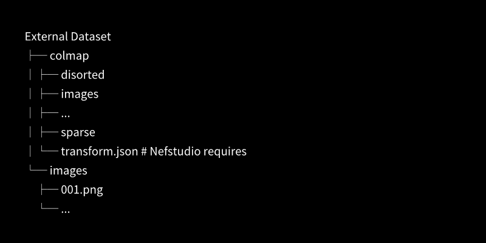

# 統合3次元再構築システム（仮）

<table>
	<thead>
    	<tr>
      		<th style="text-align:center">日本語</th>
      		<th style="text-align:center"><a href="README_en.md">English</a></th>
    	</tr>
  	</thead>
</table>

# 1. 概要  
このシステムは様々な3次元再構築手法を Web UI で一元的に扱えるようにしたものです.  
1つの UI 上で前処理，各手法による3次元再構築，可視化および評価を簡単に実行できます．

## 実装手法一覧
- [Nerfstudio](https://github.com/nerfstudio-project/nerfstudio/)
- [Vanilla NeRF（Nerfstudio）](https://github.com/bmild/nerf)
- [Nerfacto（Nerfstudio）](https://github.com/nerfstudio-project/nerfstudio/)
- [mip-NeRF（Nerfstudio）](https://github.com/google/mipnerf)
- [SeaThru-NeRF（Nerfstudio）](https://github.com/deborahLevy130/seathru_NeRF)
- [Vanilla GS](https://github.com/graphdeco-inria/gaussian-splatting)
- [Mip-Splatting](https://github.com/autonomousvision/mip-splatting)
- [Splatfacto（Nerfstudio）](https://github.com/nerfstudio-project/nerfstudio/)
- [4D-Gaussians](https://github.com/hustvl/4DGaussians)
- [DUSt3R](https://github.com/naver/dust3r)
- [MASt3R](https://github.com/naver/mast3r)
- [MonST3R](https://github.com/Junyi42/monst3r)
- [Easi3R](https://github.com/Inception3D/Easi3R)
- [MUSt3R](https://github.com/naver/must3r)
- [Fast3R](https://github.com/facebookresearch/fast3r)
- [Splatt3R](https://github.com/btsmart/splatt3r)
- [CUT3R](https://github.com/CUT3R/CUT3R)
- [WinT3R](https://github.com/LiZizun/WinT3R)
- [VGGT](https://github.com/facebookresearch/vggt)
- [VGGSfM](https://github.com/facebookresearch/vggsfm)
- [VGGT-SLAM](https://github.com/MIT-SPARK/VGGT-SLAM)
- [StreamVGGT](https://github.com/wzzheng/StreamVGGT)
- [FastVGGT](https://github.com/mystorm16/FastVGGT)
- [Pi3](https://github.com/yyfz/Pi3)
- [MoGe2](https://github.com/microsoft/MoGe)
- [UniK3D](https://github.com/lpiccinelli-eth/UniK3D)
- [Depth-Anything-V2](https://github.com/DepthAnything/Depth-Anything-V2)
- [Depth-Anything-3](https://github.com/ByteDance-Seed/depth-anything-3)

# 2. インストール
このシステムは Ubuntu を対象としています．Windows では一部利用できない手法があります．

`torch`，`torchvision`は起動環境のcudaに合わせたものをインストールしてください．下記の例の実行環境には CUDA 12.1が入っています．
```
git clone https://github.com/WSuenaga/Demo.git
cd Demo

conda create -n demo python=3.11 -y
conda activate demo

pip install torch==2.1.0+cu121 torchvision==0.16.0+cu121 --index-url https://download.pytorch.org/whl/cu121

pip install -r requirements.txt
```

前処理手法として **FFmpeg**，**COLMAP** を用いています．
- FFmpegのインストール
    ```
    sudo apt update
    sudo apt install ffmpeg
    ```
- COLMAPのインストール  
    https://colmap.github.io/install.html


各手法については個別にインストールしてください．

# 3. クイックスタート
Mip-Splattingのインストールから，データセットの作成，3次元再構築，評価までの一連の手順を説明します．  

## 3.1. Mip-Splatting のインストール
Mip-Splattingの環境構築を行います．このリポジトリにある **models/mip-splatting/** に移動し，以下のコマンドを実行してください．
```
# mip-splattingn のリポジトリへ移動
cd Demo/models/mip-splatting

# conda 環境の作成
conda create -y -n mip-splatting python=3.10
conda activate mip-splatting

# 依存関係のインストール
# 実行環境に入っているCUDAに合わせた torch, torchvision をインストールしてください．（この例では CUDA12.1）
pip install torch==2.1.0+cu121 torchvision==0.16.0+cu121 --index-url https://download.pytorch.org/whl/cu121
conda install -c "nvidia/label/cuda-12.1.0" cuda-toolkit

pip install "numpy<2.0" open3d plyfile ninja GPUtil opencv-python lpips

pip install submodules/diff-gaussian-rasterization
pip install submodules/simple-knn
```
## 3.2. Web UI の起動
conda 環境を activate し，**main.py** を実行することで Web UI を起動することができます．
表示された local URL にブラウザからアクセスしてください．
```
conda activate demo
python main.py
```
  

## 3.3. 画像データセットの作成
データセットの作成を行います．タブ一覧より`🗂️データセット`を選択し，`🛠️新規データセットの作成`を選択してください．  
ファイルの種類は`🎥動画`を選択してください．


画像データセットを作成するための動画を入力します．  
**example/** 内にある **example01.mp4** を選択してください．


`🚀データセット作成`を押すことで**画像データセット**が作られます．  
`🗂️現在セットされている画像データセット`にパスが表示されれば成功です．


## 3.4. COLMAP データセットの作成
Mip-Splatting は COLMAP 形式のデータセットを要求します．COLMAP形式のデータセット（**COLMAPデータセット**）は直前に作成した画像データセットから作成できます．
`📸COLMAP` タブに移動し，`🚀COLMAP実行`ボタンを押してください．  
下記の実行ログのように **🎉 🎉 🎉 All DONE 🎉 🎉 🎉** と表示され，`🗂️現在セットされているCOLMAPデータセット`にパスが表示されれば成功です．


## 3.5. Mip-Splattingの学習
Mip-Splatting は GS ベースの手法です．`🌐GS` タブに移動してください．  
`🌐GS` タブ内から `Mip-Splatting` を選択してください．  

学習の中断は行えまぜん．学習前に`🗂️現在セットされているCOLMAPデータセット`が正しいものか確認してください．  

`🚀学習実行`ボタンを押すことで Mip-Splatting の学習が開始されます．


学習が完了あるいは中断されると実行結果や3次元再構築結果等が表示されます． 
失敗した場合は`📝実行ログ`を確認してください． 


## 3.6. Mip-Splatting の評価
`🚀レンダリング＆評価実行`ボタンを押すことで3次元再構築結果からテスト画像のレンダリングと，テスト画像の定量的評価を行うことができます．  


# 4. システムの詳細

## 手法のインストール
それぞれの手法のインストールは基本的に公式のリポジトリに従い，**Demo/models/** 配下にある各手法のリポジトリ内で環境構築を行ってください．  

### 環境構築にあたっての注意
以下の手法のインストールを公式の手順通り行った場合，問題が発生する可能性があります．  
つぎの通り修正してください．

<details>
<summary>monst3r</summary>

- demo.pyの297行目を以下に修正．
    ```
    winsize = gradio.Slider(label="Scene Graph: Window Size", value=5,
                    minimum=1, maximum=10, step=1, visible=False)
    ```
- typoの修正．
    ```
    cd gradio/models/monst3r/third_party/RAFT/core/configs
    mv congif_spring_M.json config_spring_M.json
    ```
</details>

<details>
<summary>Easi3R</summary>

- demo.pyの324行目を以下に修正．
    ```
    winsize = gradio.Slider(label="Scene Graph: Window Size", value=5,
                    minimum=1, maximum=10, step=1, visible=False)
    ```
- demo.pyの505行目を以下に修正．
    ```
    scene, outfile, *_ = recon_fun(...)
    ```
</details>

<details>
<summary>VGGT</summary>

- requirements_demo.txtの最初に次を記載．
    ```
    numpy<2.0
    ```
</details>

### 学習済みモデルのダウンロード
以下の手法は学習済みモデルを要求します．各手法のリポジトリ内で以下を実行してください．

<details>
<summary>monst3r</summary>

```
cd data
bash download_ckpt.sh
cd ..
```
</details>

<details>
<summary>Easi3R</summary>

```
cd data
bash download_ckpt.sh
cd ..
```
</details>

<details>
<summary>MUSt3R</summary>

https://github.com/naver/must3r?tab=readme-ov-file#checkpoints
- 上記より以下をダウンロード.
    - MUSt3R_512.pth
    - MUSt3R_512_retrieval_codebook.pkl
    - MUSt3R_512_retrieval_trainingfree.pth
- ckpt ディレクトリを作成し，その中にダウンロードしたものを配置．
    ```
    mkdir ckpt
    ```
</details>

<details>
<summary>Fast3R</summary>

https://github.com/naver/must3r?tab=readme-ov-file#checkpoints
- 上記より以下をダウンロード.
    - MUSt3R_512.pth
    - MUSt3R_512_retrieval_codebook.pkl
    - MUSt3R_512_retrieval_trainingfree.pth
- ckpt ディレクトリを作成し，その中にダウンロードしたものを配置．
    ```
    mkdir ckpt
    ```
</details>

<details>
<summary>CUT3R</summary>

```
cd src
# for 224 linear ckpt
gdown --fuzzy https://drive.google.com/file/d/11dAgFkWHpaOHsR6iuitlB_v4NFFBrWjy/view?usp=drive_link 
# for 512 dpt ckpt
gdown --fuzzy https://drive.google.com/file/d/1Asz-ZB3FfpzZYwunhQvNPZEUA8XUNAYD/view?usp=drive_link
cd ..
```
</details>

<details>
<summary>WinT3R</summary>

- 以下をダウンロード．  
[https://huggingface.co/lizizun/WinT3R/resolve/main/pytorch_model.bin](https://huggingface.co/lizizun/WinT3R/resolve/main/pytorch_model.bin)
- checkpoints ディレクトリを作成し，その中にダウンロードしたものを配置．
    ```
    mkdir checkpoints
    ```
</details>

<details>
<summary>StreamVGGT</summary>

- 以下をダウンロード．  
https://huggingface.co/facebook/VGGT-1B/blob/main/model.pt
- ckpt ディレクトリを作成し，その中にダウンロードしたものを配置．
    ```
    mkdir ckpt
    ```
</details>

<details>
<summary>FastVGGT</summary>

- 以下をダウンロード．  
https://huggingface.co/facebook/VGGT_tracker_fixed/resolve/main/model_tracker_fixed_e20.pt
- ckpt ディレクトリを作成し，その中にダウンロードしたものを配置．
    ```
    mkdir ckpt
    ```
</details>

## Web UI の起動
conda 環境を activate し，main.py を実行することで Web UI を起動することができます．
```
conda activate demo
python main.py
```
  

表示された **local URL** より，Web UI にアクセスできます．  
**Working Directory** はシステムの入力ファイル，出力ファイルが保存される一時ディレクトリです．  
**ctrl** + **c** で Web UI をシャットダウンできます．この時，一時ディレクトリも削除されます．

一時ディレクトリの構成は以下となります．
```
Working Directory
├─ datasets
├─ logs
└─ outputs
```
- **datasets**
    - システムにより作成したデータセット・アップロードされたデータセットが保存される．
- **logs**
    - 各手法の処理を実行するたびにログファイルがここに生成さる．ログファイル名は実行時刻を表す．
- **outputs**
    - 各手法の出力ファイルが保存される．

## Web UI
Web UI のデフォルト言語は日本語です．UI 上部の`🌐言語 / Language`より言語を切り替えることができます．  

`🗂️現在セットされている画像データセット`，`🗂️現在セットされているCOLMAPデータセット`にはシステムにセットされたデータセットへのパスが表示されます．  システムはここに表示されたデータセットを3次元再構築に用います．  
- `🗂️現在セットされている画像データセット`を用いる手法 : `🌐3sters`，`🌐VGGT`
- `🗂️現在セットされているCOLMAPデータセット`を用いる手法 : `🌐NeRF`，`🌐GS`

画像データセット，COLMAPデータセットとは次の構造をしたディレクトリのことを指します．
- 画像データセット
    - 画像のみで構成されているディレクトリです．システム内部では **<一時ディレクトリ>/datasets/<データセット名>/images/** のことを指しています．
- COLMAPデータセット
    - 入力画像およびCOLMAPによるSfMの結果で構成されているディレクトリです．システム内部では **<一時ディレクトリ>/datasets/<データセット名>/colmap/** のことを指しています．

Web UI は大別して，つぎのタブに分けられます．  
  

- `🗂️データセット`タブ
    - システムにデータセットをセットするタブです．画像データセットの作成，既存データセットの読み込みを行えます．
- `📸COLMAP`タブ
    - セットされている画像データセットからCOLMAPデータセットを作成，セットするタブです．
- `🌐NeRF`タブ
    - `Vanilla NeRF`，`Nerfacto`，`mip-NeRF`，`SeaThru-NeRF` の学習，評価を行えます．
- `🌐GS`タブ
    - `Vanilla GS`，`Mip-Splatting`，`Splatfacto`，`4D-Gaussians` の学習，評価を行えます．
- `🌐3sters`タブ
    - `DUSt3R`，`MASt3R`，`MonST3R`，`Easi3R`，`MUSt3R`，`Fast3R`，`Splatt3R`，`CUT3R`，`WinT3R` の推論を行えます．
- `🌐VGGT`タブ
    - `VGGT`，`VGGSfM`，`VGGT-SLAM`，`StreamVGGT`，`FastVGGT`，`Pi3` の推論を行えます．
- `🌐mds`タブ
    - `MoGe2`，`UniK3D`，`Depth-Anything-V2`，`DepthAnything-3` の推論を行えます．
- `📊評価指標`タブ
    - 各タブで実行した手法ごとの評価指標をまとめて確認することができます．

## `🗂️データセット`タブ
データセットをシステムにセットするタブです．  
新規データセットの作成あるいは既存データセットを展開を行うことで，データセットをシステムにセットすることができます．  
使用するデータセットを変更する場合には，このタブで作成もしくは展開の操作を再度行ってください．

### `🛠️新規データセットの作成`
画像もしくは動画を入力として画像データセットを作成し，システムにセットします．

`📷画像`を用いる場合，使用したい画像をまとめて選択することで1つの画像データセットが作成されます．  
データセットには任意の名前を与えることができます．何も入力しない場合，ランダムな名前が付与されます．

`🎥動画`を用いる場合，1つの動画から等間隔でフレームを切り出すことで1つの画像データセットが作成されます．  
切り出す間隔は1から5で選択でき，デフォルトでは1秒間に3フレーム，0.33秒に1枚切り出される設定です．  
また，データセットを3次元再構築に適したものにするためのオプションが用意されています．
- `データセットを圧縮する`
    - 動画から切り出された画像同士を比較し，似たような画像を削除して画像枚数を減らす処理．デフォルトでは有効．
    - `SSIMの閾値`は画像同士がどれくらい似ていれば削除するかの基準値．値が高いほど画像は削除されにくくなる．
    - 計算リソースの節約につながる．

作成した画像データセットは zip ファイルとしてダウンロードできます．  
この zip ファイルは既存データセットとして扱われ，アップロードすることでこのタブの処理を省略できます．

### `📂既存データセットの展開`
zip 圧縮された既存データセットを読み込み，システムにセットします．  
基本的にこのシステムで作成されたデータセットを想定していますが，外部のデータセットを用いたい場合，ディレクトリ構造が以下になるように注意してから zip 圧縮を行ってください．
- 期待するディレクトリ構造
    - imagesディレクトリ（画像データセット），colmapディレクトリ（COLMAPデータセット）の少なくともいずれか一方が必要です．
    - Nerfstudioで実装されている手法に用いる場合，Nerfstudioのns-process-dataで生成される**transform.json**が要求されます．
    

アップロードされた既存データセット内に画像データセットやCOLMAPデータセットが存在する場合，それぞれ自動的にシステムにセットされます．

## `📸COLMAP`タブ
`🗂️現在セットされている画像データセット`を用いて，`🌐NeRF`タブ・ `🌐GS`タブの3次元再構築手法で利用できるCOLMAPデータセットを作成することができます．

以下のオプションが用意されています．
- `🛠️前処理を再実行`
    - 現在セットされているCOLMAPデータセットを完全に削除し，再度COLMAPデータセットを作成します．
    - 作成中にエラーが出た場合，このオプションを試してみてください．

作成したデータセットは zip ファイルとしてダウンロードできます．  
この zip ファイルは既存データセットとして扱われ，アップロードすることでこのタブの処理を省略できます．

## `🌐NeRF`タブ
`Vanilla NeRF`，`Nerfacto`，`mip-NeRF`，`SeaThru-NeRF` の学習，評価を行えます．  
学習にはCOLMAPデータセットを使用します．  
オプションとして実行環境，学習のイテレーション数を指定できます．  
実行環境は`local`，`slurm`のいずれかを選択できます．
- `local`
    - Web UI を立ち上げたサーバーのconda環境を使用．
- `slurm`
    - slurmの実行ノードにあるconda環境を使用．

いずれの手法も学習経過をビュアーにより確認できます．（※3次元再構築結果の可視化機能は実装予定です）

## `🌐GS`タブ
`Vanilla GS`，`Mip-Splatting`，`Splatfacto`，`4D-Gaussians` の学習，評価を行えます．  
学習にはCOLMAPデータセットを使用します．  
オプションとして実行環境，学習のイテレーション数を指定できます．  
実行環境は`local`，`slurm`のいずれかを選択できます．
- `local`
    - Web UI を立ち上げたサーバーのconda環境を使用．
- `slurm`
    - slurmの実行ノードにあるconda環境を使用．

`Splatfacto`は学習経過をビュアーにより確認できます．（※3次元再構築結果の可視化機能は実装予定です）

## `🌐3sters`タブ
`DUSt3R`，`MASt3R`，`MonST3R`，`Easi3R`，`MUSt3R`，`Fast3R`，`Splatt3R`，`CUT3R`，`WinT3R` の推論を行えます．  
推論には画像データセットを使用します．
実行環境は`local`，`slurm`のいずれかを選択できます．
- `local`
    - Web UI を立ち上げたサーバーのconda環境を使用．
- `slurm`
    - slurmの実行ノードにあるconda環境を使用．

## `🌐VGGT`タブ
`VGGT`，`VGGSfM`，`VGGT-SLAM`，`StreamVGGT`，`FastVGGT`，`Pi3` の推論を行えます．
推論には画像データセットを使用します．
実行環境は`local`，`slurm`のいずれかを選択できます．
- `local`
    - Web UI を立ち上げたサーバーのconda環境を使用．
- `slurm`
    - slurmの実行ノードにあるconda環境を使用．

## `🌐mds`タブ
`MoGe`，`UniK3D` の推論を行えます．
実行環境は`local`，`slurm`のいずれかを選択できます．
- `local`
    - Web UI を立ち上げたサーバーのconda環境を使用．
- `slurm`
    - slurmの実行ノードにあるconda環境を使用．

## `📊評価指標`タブ
手法ごとの各評価指標による評価結果をまとめて確認できます．  
各手法で評価が行われると，自動的に評価結果が追加されていきます．

このテーブルは CSV としてダウンロードできます．