# UNe3dMe: A Unified Interface for Neural 3D Reconstruction Methods

<table>
    <thead>
        <tr>
            <th style="text-align:center"><a href="README.md">日本語</a></th>
            <th style="text-align:center">English</th>
        </tr>
    </thead>
</table>

# 1. Overview
This system provides a unified Web UI for various 3D reconstruction methods.  
You can easily perform preprocessing, 3D reconstruction with multiple methods, visualization, and evaluation — all from a single interface.

## Supported Methods
- [Nerfstudio](https://github.com/nerfstudio-project/nerfstudio/)
- [Vanilla NeRF (Nerfstudio)](https://github.com/bmild/nerf)
- [Nerfacto (Nerfstudio)](https://github.com/nerfstudio-project/nerfstudio/)
- [mip-NeRF (Nerfstudio)](https://github.com/google/mipnerf)
- [SeaThru-NeRF (Nerfstudio)](https://github.com/deborahLevy130/seathru_NeRF)
- [Vanilla GS](https://github.com/graphdeco-inria/gaussian-splatting)
- [Mip-Splatting](https://github.com/autonomousvision/mip-splatting)
- [Splatfacto (Nerfstudio)](https://github.com/nerfstudio-project/nerfstudio/)
- [4D-Gaussians](https://github.com/hustvl/4DGaussians)
- [DUSt3R](https://github.com/naver/dust3r)
- [MASt3R](https://github.com/naver/mast3r)
- [MonST3R](https://github.com/Junyi42/monst3r)
- [Easi3R](https://github.com/Inception3D/Easi3R)
- [MUSt3R](https://github.com/naver/must3r)
- [Fast3R](https://github.com/facebookresearch/fast3r)
- [Splatt3R](https://github.com/btsmart/splatt3r)
- [CUT3R](https://github.com/CUT3R/CUT3R)
- [WinT3R](https://github.com/LiZizun/WinT3R)
- [VGGT](https://github.com/facebookresearch/vggt)
- [VGGSfM](https://github.com/facebookresearch/vggsfm)
- [VGGT-SLAM](https://github.com/MIT-SPARK/VGGT-SLAM)
- [StreamVGGT](https://github.com/wzzheng/StreamVGGT)
- [FastVGGT](https://github.com/mystorm16/FastVGGT)
- [Pi3](https://github.com/yyfz/Pi3)
- [MoGe2](https://github.com/microsoft/MoGe)
- [UniK3D](https://github.com/lpiccinelli-eth/UniK3D)
- [Depth-Anything-V2](https://github.com/DepthAnything/Depth-Anything-V2)
- [Depth-Anything-3](https://github.com/ByteDance-Seed/depth-anything-3)

# 2. Installation
This system targets Ubuntu. Some methods may not work on Windows.

Please install torch and torchvision versions that match the CUDA version of the Web UI runtime environment.  
In the example below, the environment uses CUDA 12.1.  
```
git clone --recursive https://github.com/WSuenaga/UNe3dMe.git
cd UNe3dMe

conda create -n UNe3dMe python=3.11 -y
conda activate UNe3dMe

pip install torch==2.1.0+cu121 torchvision==0.16.0+cu121 --index-url https://download.pytorch.org/whl/cu121

pip install -r requirements.txt
```

This system uses **FFmpeg** and **COLMAP** for preprocessing.
- Install FFmpeg  
    ```
    sudo apt update
    sudo apt install ffmpeg
    ```
- Install COLMAP  
    https://colmap.github.io/install.html

Please install each reconstruction method individually.

# 3. Quick Start
This section explains the workflow, from installing Mip-Splatting to dataset creation, training, visualization of the 3D reconstruction results, and rendering and evaluation.

## 3.1. Installing Mip-Splatting
Set up the Mip-Splatting environment.  
Move to **models/mip-splatting/** in this repository and execute the following commands:
```
cd models/mip-splatting

conda create -y -n mip-splatting python=3.10
conda activate mip-splatting

pip install torch==2.1.0+cu121 torchvision==0.16.0+cu121 --index-url https://download.pytorch.org/whl/cu121
conda install -c "nvidia/label/cuda-12.1.0" cuda-toolkit

pip install "numpy<2.0" open3d plyfile ninja GPUtil opencv-python lpips

pip install submodules/diff-gaussian-rasterization
pip install submodules/simple-knn

cd ../..
```

## 3.2. Launching the Web UI
Activate the conda environment and run **main.py** to launch the Web UI.  
Open the local URL in your browser.
```
conda activate UNe3dMe
python main.py
```
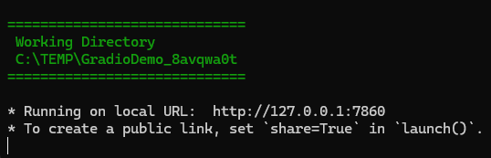  

## 3.3. Creating an Image Dataset
Create a dataset.  
From the tab list, select `🗂️ Dataset`, then choose `🛠️ Create New Dataset`.
Select `🎥 Video` as the file type.  

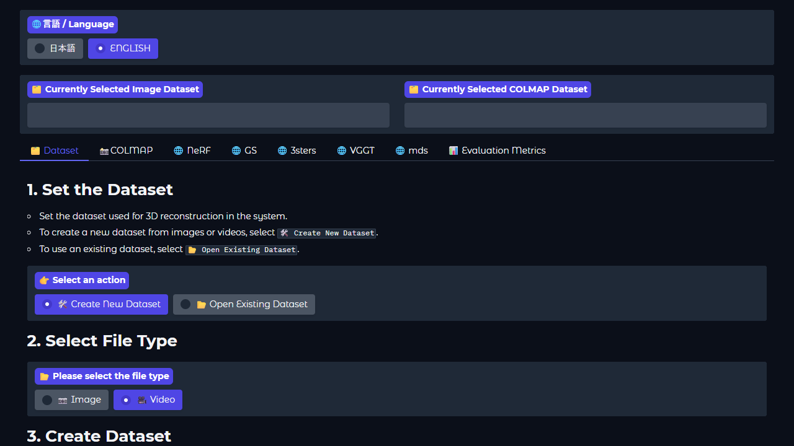

Provide a video file to create an image dataset.  
Select **example01.mp4** inside **example/**.

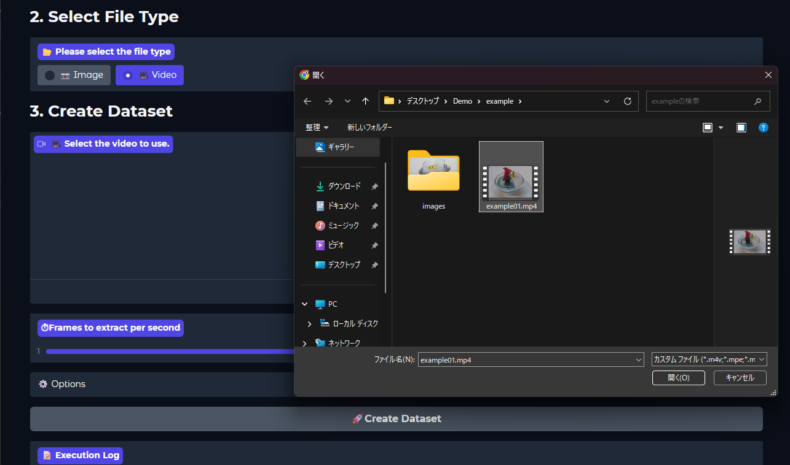

Click `🚀 Create Dataset` to create an image dataset.  
If a path is displayed under `🗂️ Currently Selected Image Dataset`, the dataset was created successfully.

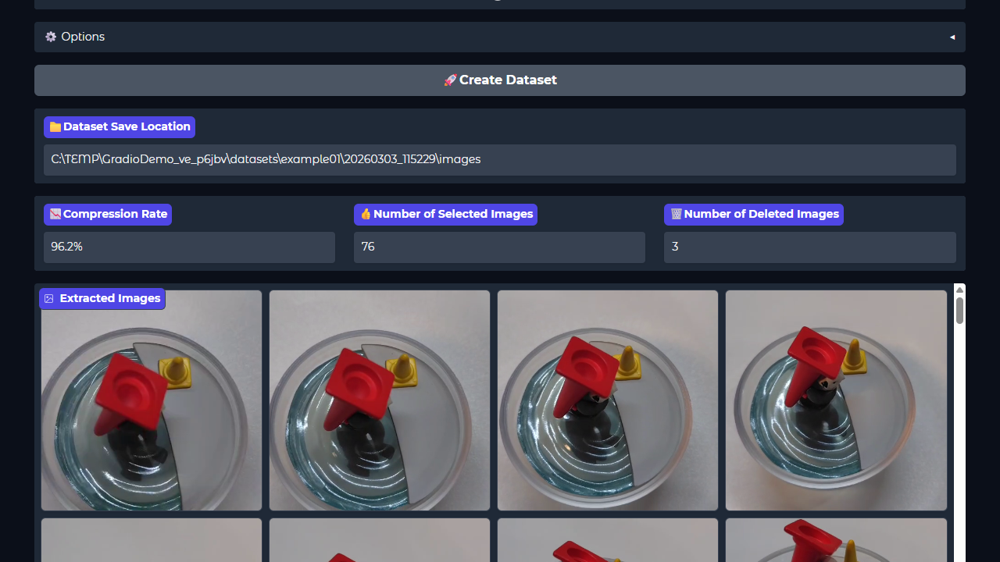

## 3.4. Creating a COLMAP Dataset
Mip-Splatting requires a dataset in COLMAP format.  
A COLMAP-format dataset (**COLMAP dataset**) can be created from the image dataset created in the previous step.

Go to the `📸 COLMAP` tab and click the `🚀 Run COLMAP` button.

If **🎉 🎉 🎉 All DONE 🎉 🎉 🎉** appears in the execution log and the path is displayed under `🗂️ Currently Selected COLMAP Dataset`, the process is successful.

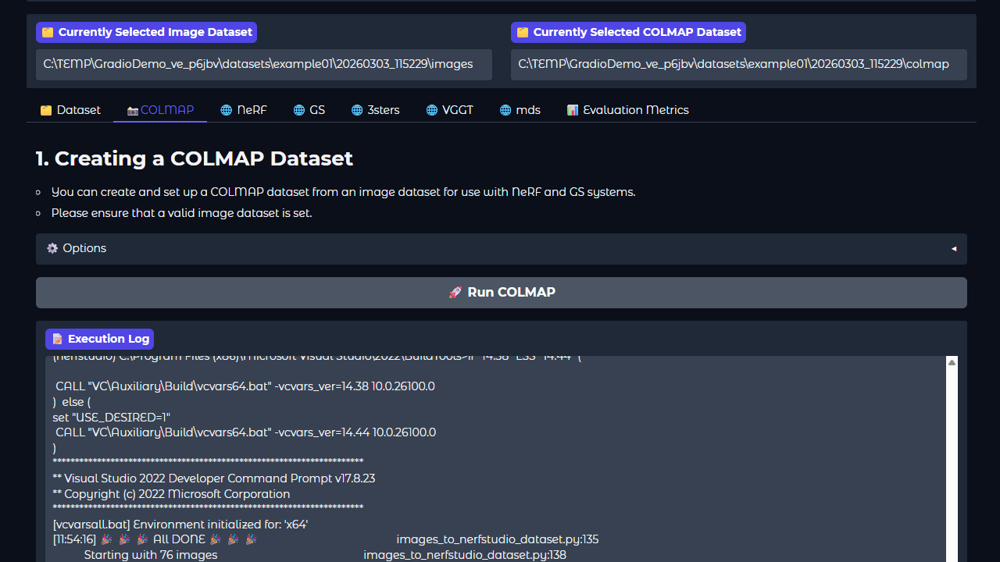

## 3.5. Training Mip-Splatting
Mip-Splatting is a GS-based method. Go to the `🌐 GS` tab.  
Then select `Mip-Splatting` from within the `🌐 GS` tab.

Training cannot be interrupted. Before starting training, make sure that `🗂️ Currently Selected COLMAP Dataset` is correct.

Click the `🚀 Start Training` button to begin training Mip-Splatting.

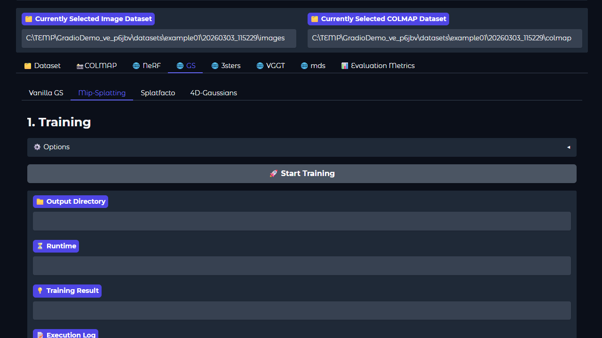

When training completes or fails, the execution results will be displayed.  
If the process fails, check the `📝 Execution Log`.

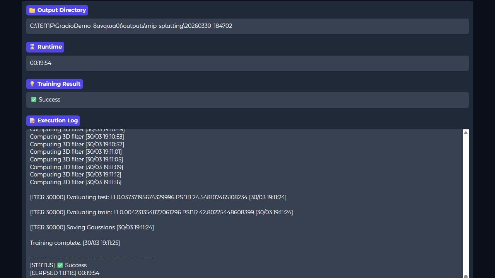

## 3.6. Visualizing the 3D Reconstruction Results
This system uses **viser** to visualize the 3D reconstruction results. You can start the server by clicking the `🚀 Launch Viewer` button.  
If a URL appears under `Viewer URL`, the viewer has started successfully. Please open it in your browser.

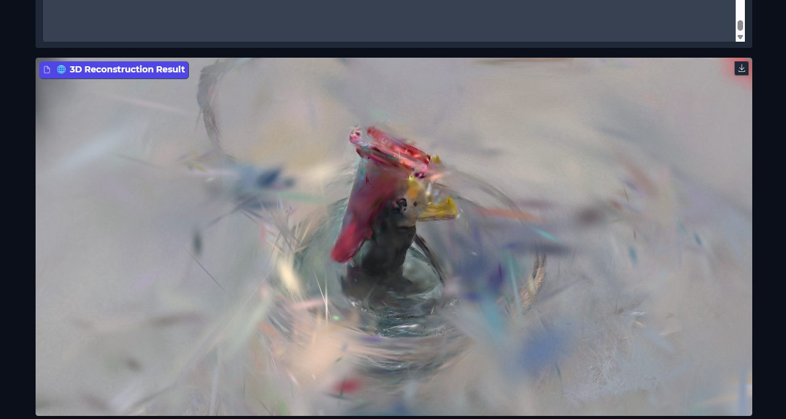

For viewer controls, refer to the right-side control panel.

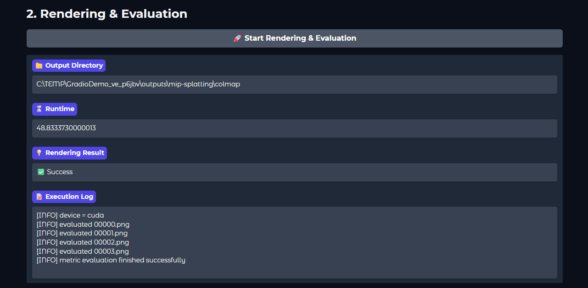

To close the viewer, check the checkbox under **Server Settings** at the bottom of the side panel, then click the `Shutdown Server` button.

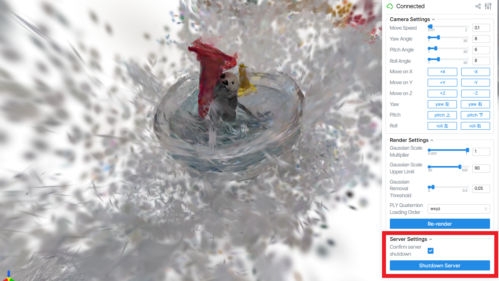


## 3.7. Rendering and Evaluation
By clicking the `🚀 Run Rendering & Evaluation` button, you can render test images from the 3D reconstruction results and perform quantitative evaluation on the test images.

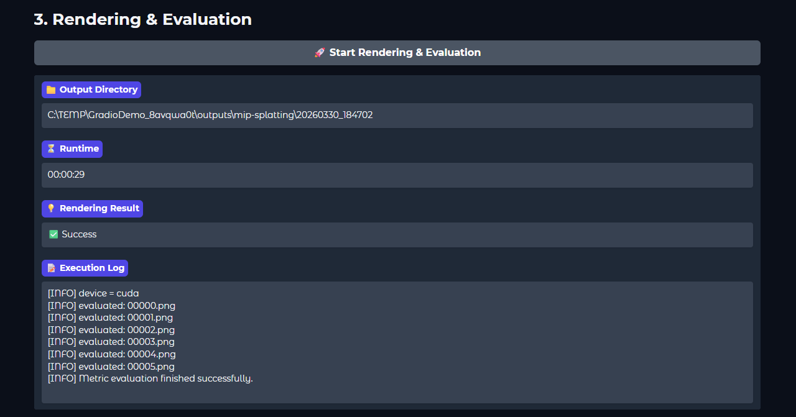
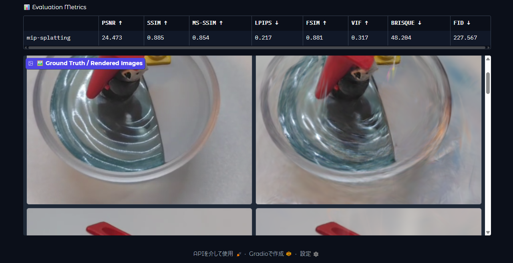